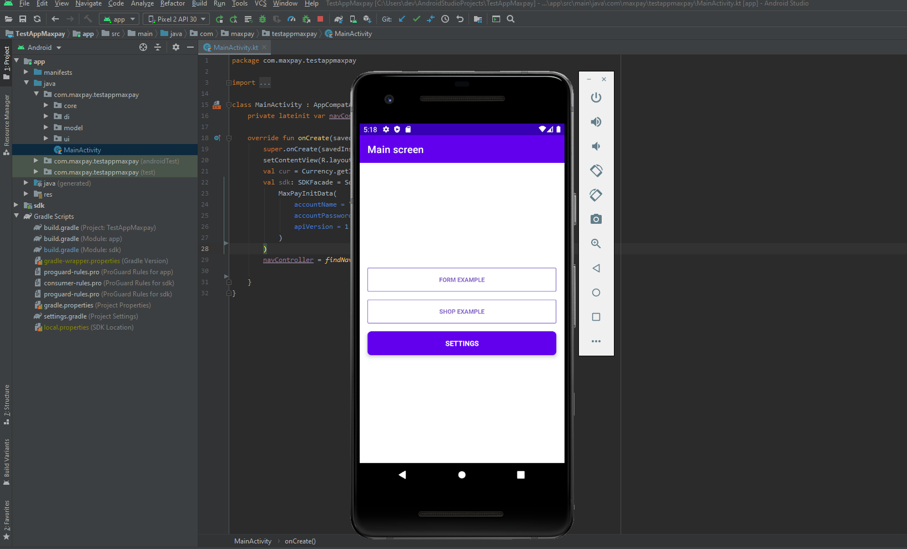

# MaxPay Android SDK

The MaxPay Android SDK makes it quick and easy to build a payment screen in your Android app. We provide customizable SDKFacade that can be used out-of-the-box.

## Content
* [Requirements](#markdown-header-requirements)
* [Installation](#markdown-header-installation)
* [Integration with SDK](#markdown-header-integration-with-sdk)
* [Example](#markdown-header-examples)
* 

## Requirements
Android 5.0, Android studio 4.0.1, kotlin_version = "1.3.72"+

## Installation
### 1. Clone or download repository.

### 2. Import downloaded project trough android studio

### 3. Compile and start test project on emulator or Android device

## Integration with SDK

[How integrate SDK to your project see here](readme/INTEGRATION.md).

## Examples
With framework you downloaded example project.
In this project you can use simple form, when you can fast create payment auth or sale request, choose currency and enter payment amount. Also you can change customer data and decide show or not billing address on payment screen.