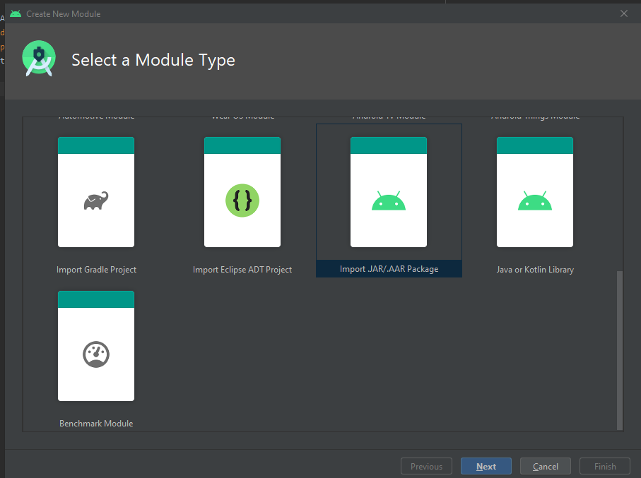
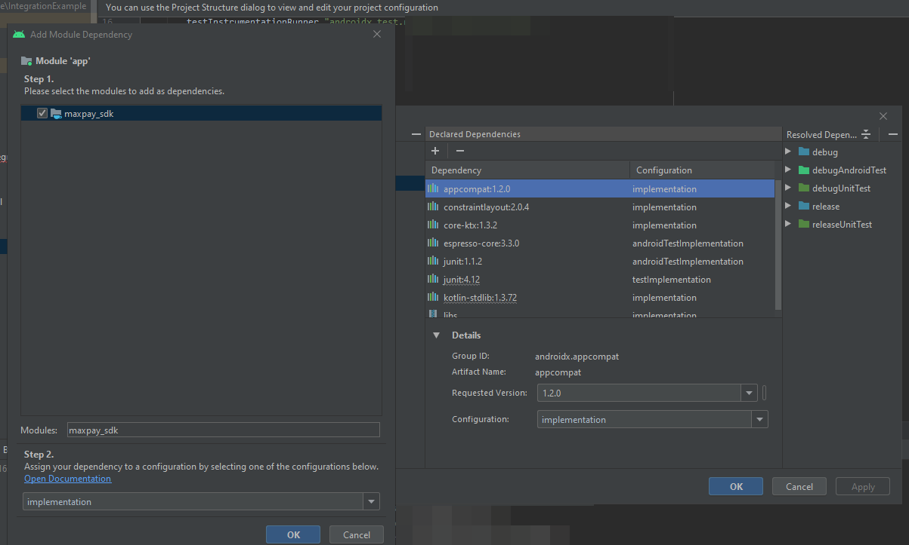

# Basic Integration

## 1. Set up PaySDK

First of all [register](https://my.maxpay.com/#/signup) on site [Maxpay](https://maxpay.com/) and get merchant login and password.


## 2. Add .aar as dependency to your project

### 1. Download .aar file.

### 2. Import downloaded module to your android project

Click new -> new module...




After clicking next you will see import module from library window. Find location of your .aar file, choose subproject name and click Finish button


### PaySDK

To use PaySDK inside your app, you need to provide dependency to paySdk. Click File -> Project Structure -> Choose your app module, click + button -> module dependency here you can find "pay_sdk" module




Now you can use SDK inside your application


### 4. Dependencies

To use PaySDK inside your app, you need to provide dependencies

```groovy
	// You can use versions upper this
    implementation 'com.google.android.material:material:1.2.1'
    implementation 'androidx.navigation:navigation-fragment-ktx:2.3.1'
    implementation 'androidx.navigation:navigation-ui-ktx:2.3.1'

    implementation 'androidx.navigation:navigation-fragment:2.3.1'
    implementation 'androidx.navigation:navigation-ui:2.3.1'
    implementation "com.squareup.retrofit2:retrofit:2.7.2"
    implementation 'org.koin:koin-androidx-viewmodel:2.0.1'
    implementation 'org.koin:koin-androidx-scope:2.0.1'
    implementation 'org.koin:koin-android:2.0.1'
    implementation 'io.reactivex.rxjava2:rxandroid:2.0.2'
    implementation 'io.reactivex.rxjava2:rxjava:2.2.8'
    implementation 'io.reactivex.rxjava2:rxkotlin:2.3.0'
    implementation 'com.squareup.retrofit2:retrofit:2.5.0'
    implementation 'com.squareup.okhttp3:logging-interceptor:3.14.0'
    implementation 'com.squareup.retrofit2:adapter-rxjava2:2.5.0'
    implementation 'com.squareup.retrofit2:converter-gson:2.5.0'
    implementation "org.jetbrains.kotlin:kotlin-stdlib-jdk8:$kotlin_version"
    implementation 'com.google.code.gson:gson:2.8.5'
    implementation 'androidx.legacy:legacy-support-v4:1.0.0'
    implementation "androidx.browser:browser:1.2.0"
}
```


## 2 Prepare data

In your application create all necessary forms and request to collect all data about merchant, customer and order.
On the basis of the information obtained create **PayInitInfo**, **PayPaymentInfo**.

### 2.1 Prepare merchant data

**MXPMerchant** provides information about merchant.

| Property     | Type            | Description                                   | Note     |
| ------------ | --------------- | --------------------------------------------- | -------- |
| apiVersion   | Int             | API version                                   | required |
| publicKey    | String          | Merchant public key                           | required |
| fieldsToShow | AvailableFields | Fields that need to show in billing address   | optional |
| theme        | PayTheme        | Custom theme, to change payment screen colors | optional |


**AvailableFields** Object what fields to show on payment screen

| Property                 | Type    | Description                                                  | Note     |
| ------------------------ | ------- | ------------------------------------------------------------ | -------- |
| showBillingAddressLayout | Boolean | Is need to show billing address layout. If set to false, all fields of billing address will be hidden | required |
| showNameField            | Boolean | Set this flag if you need to name field be shown in the payment screen | optional |
| showAddressField         | Boolean | Set this flag if you need to address field be shown in the payment screen | optional |
| showCityField            | Boolean | Set this flag if you need to city field be shown in the payment screen | optional |
| showZipField             | Boolean | Set this flag if you need to zip field be shown in the payment screen | optional |
| showCountryField         | Boolean | Set this flag if you need to country field be shown in the payment screen | optional |
| showBirthdayField        | Boolean | Set this flag if you need to birthday field be shown in the payment screen | optional |


### 2.2 Prepare customer data

**PayPaymentInfo** provides information about customer.

| Property          | Type              | Description                                                  | Note     |
| ----------------- | ----------------- | ------------------------------------------------------------ | -------- |
| firstName         | String            | The first name of the customer                               | required |
| lastName          | String            | The last name of the customer                                | required |
| userPhone         | String            | Customer's phone number.                                     | optional |
| email             | String            | Customer's email address                                     | required |
| ip                | String            | Customer's IP address. Not all acquirers support IPv6 format | required |
| city              | String            |                                                              | optional |
| transactionType   | TransactionType   | Type of transaction Sale, sale3d                             | required |
| transactionId     | Int               | Unique id                                                    | required |
| zip               | String            |                                                              | optional |
| address           | String            |                                                              | optional |
| state             | String            |                                                              | optional |
| country           | String            |                                                              | optional |
| userEmail         | String            |                                                              | optional |
| sale3dCallBackUrl | String            | This is needed for 3D secure                                 | optional |
| sale3dRedirectUrl | String            | This is needed for 3D secure                                 | optional |
| auth3dRedirectUrl | auth3dRedirectUrl |                                                              |          |
| currency          | Currency          | Currency of order                                            | required |
| birthday          | String            |                                                              |          |

**TransactionType** is transaction types supported by PaySDK.

| State  |
| ------ |
| SALE   |
| AUTH   |
| SALE3D |
| AUTH3D |

## 3 Set up an SDKFacade

Class **SDKFacade** provides information to create payment request to Pay service.

```kotlin
        val sdk: SDKFacade = SdkFacadeImpl(
		   val initInfo = PayInitInfo(
                apiVersion = 1,
                fieldsToShow = AvailableFields() // Fill data class to show fields that you want to show
                publicKey = "YourPublicKey"
                theme = null// Or you can add your theme manually by filling PayTheme data class
            )
            )

			val payInfo = PayPaymentInfo() // Fill data class
            sdk.pay(context,initInfo, payInfo, object: PayCallback {
                override fun onResponseResult(result: PayResult?) {
                    _viewState.payResult.value = result
                }

                override fun onNeedCalculateSignature(dataForSignature: PaySignatureInfo?,
                                                      signatureCalback: (String)-> Unit) {
                    Thread {
                        dataForSignature?.let { it1 ->
                            val signature =
                                SignatureHelper("YOUR_PRIVATE_KEY").getHashOfRequest(
                                    it1
                                )
                            signatureCalback.invoke(signature)
                        }
                    }.start()
                }

            })

```


**language** - PaySDK provides different languages for the payment page localization. Available languages English, Russian, German, French, Portuguese, Italian, Spanish, Turkish, Swedish, Norwegian, Danish, Finnish, Dutch, Irish, Polish, Lithuanian.

## 4 Set up an PayTheme

**PayTheme** objects can be used to visually style pay-provided UI.

 Here you can find sample how to customize UI by filling PayTheme object


     PayTheme(
         fieldTitleColor = Color.RED,
         fieldBackgroundColor = Color.YELLOW,
         fieldTextColor = Color.CYAN,
         errorColor = Color.YELLOW,
         backgroundColor = Color.CYAN,
         navigationBarColor = Color.GREEN,
         navigationBarTitleColor = Color.BLACK,
         hyperlinkColor = Color.RED,
         headerAmountColor = Color.RED,
         headerTitleColor = Color.GREEN,
         headerAmountFont = font,
         headerStandardTitleFont = font,
         headerLargeTitleFont = font,
         headerSeparatorColor = Color.RED,
         disabledButtonBackgroundColor = Color.BLACK,
         disabledButtonTitleColor = Color.WHITE,
         enabledButtonBackgroundColor =  Color.RED,
         enabledButtonTitleColor =  Color.BLACK
     )


## 5. Handle the user's billing address

**Out of scope**

Explanation difference between shipping and billing addresses.
Best practies how to prefill billing address if bank support AVS (address verification system).


## 6. Test the integration

[Test data from Maxpay.](https://maxpay.com/docs/#test-mode)


## Integration prebuilt UI
[How to use prebuilt UI see here](README/INTEGRATION.md).

## Examples
With framework you downloaded example project.
In this project you can use simple form, when you can fast create payment auth or sale request wit, choose currency and enter payment amount. Also you can change customer data and decide show or not billing address on payment screen.

**Warning. Billing address on payment screen is out of scope MVP. Not all functions will work correctly.**


**Warning. Shop is out of scope MVP. Not all functions will work correctly.**

Also you can run shop imitation with cart and shipment form. Currency, transaction type and theme can change in Settings menu.
